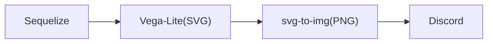
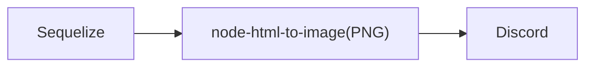

# しゃろほー bot

しゃろほーであなたのDiscordサーバーのメンバーと競おう！

## 使い方

デフォルト接頭辞：`&`

### `しゃろほー`
毎日23:59:00から00:00:59までのしゃろほーを計測します。

### `ランク`
ユーザーのランクを表示します。

### `しゃろしゃろ`
メッセージの送信時刻を表示します。

### `&set`
リザルトを送信するチャンネルに設定します。

### `&remove`
リザルトチャンネルから除外します。

### `&help`
ヘルプを表示します。

### `&about`
bot情報を表示します。

## 設定
設定は`.env`ファイルで行います。

```
TOKEN="Discord botトークン"
PREFIX="&"
```

## データ構造

### プレイヤーデータ

| id     | name   | win | part | rating | record | best   | last   |
| ------ | ------ | --- | ---- | ------ | ------ | ------ | ------ |
| ユーザーID | ユーザー名 | 優勝回数 | 参加回数 | 現在のレート | 参加記録 | 最高記録（hh:mm:ss.fff） | 最終参加日時 |
| string | string | int | int  | int    | json   | string | string |

record内構造：

```json
[
    {
        "date": "日付（YYYY/MM/DD hh:mm:ss）",
        "rate": "レート"
    },
]
```

### サーバーデータ

| key     | guild   |
| ------ | ------ |
| `guild` | リザルト対応配列 |
| string | json |

guild内構造：

```json
[
    {
        "guild": "サーバーID",
        "channel": "チャンネルID"
    },
]
```

## レート計算

Diffは23:59の場合は60と現在秒の差、00:00の場合は現在秒を表します。
Partは参加回数です。
~~レート計算の関数が良くないので誰か良い案を考えてほしい~~

### 初回参加時

$$ Rate = \left[ \frac{6200}{Diff + 2.1} \right] $$

### 2回目以降

$$ Rate = \left[ \frac{6000 + Part}{Diff + 1.98} \right] $$

## 画像処理

### ランク


### リザルト


## Q&A

**Q:** SequelizeのDATE型を使わないんですか？  
**A:** 変えるのが面倒くさい

##

**Q:** SQLite以外のサポートを予定してますか？  
**A:** 今後対応予定

## 

**Q:** ファイル分割した方がメンテしやすくないですか？   
**A:** ワイトもそう思います

## 

**Q:** SequelizeとEnmap分ける意味ありました？  
**A:** あったのかもしれない
